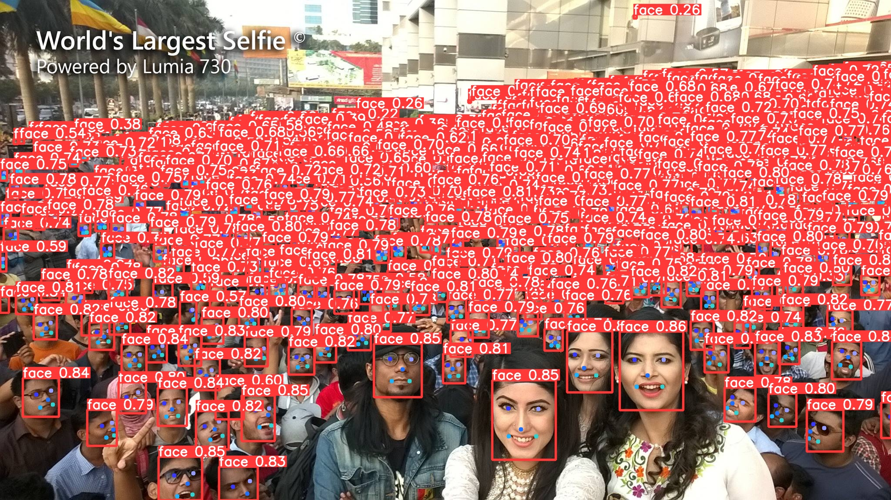
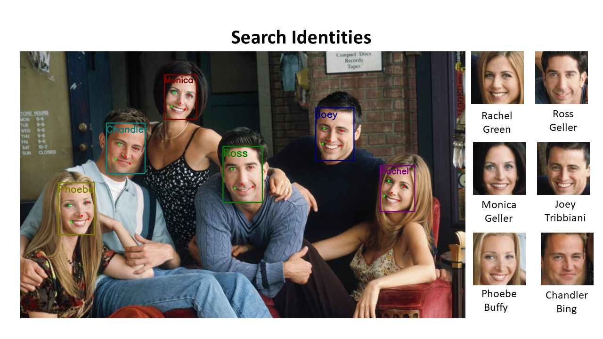

Facial detection and recognition engine based on pytorch

The project uses [YoloV8](https://github.com/derronqi/yolov8-face) for detecting faces, then applies a simple alignment for each detected face and feeds those aligned faces into embeddings model provided by [InsightFace](https://github.com/deepinsight/insightface). Finally, a softmax classifier was put on top of embedded vectors for classification task.

1. Face detection

2. Face Recognition

##### How to install dependencies 

Run the following command to install the packages:

Using pip:

pip install -r requirements.txt

#### How to test 

1. please create "Photos" and "Videos" folder.
2. Download pretraind model for facial reconition. Please reference "insightface/README.md".
3. Copy photos(still images) to Photos and videos to Videos.
4. Run following command to run the program:

    python main.py --imgpath Photos

    or for videos:

    python main.py --imgpath Videos